# Demo Wallet

_Ionic/Angular/Typescript/JWT/Spring Boot/Hibernate/Postgres/Redis_

Roles: Player & Admin
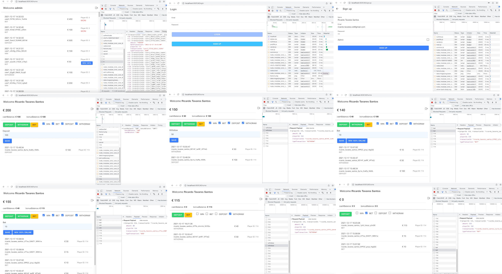

## Run: localhost (desenv)

**DB:**

./wallet

Postgres: App
```sh
docker-compose up -d db
```
Redis: Idempotency
```sh
docker-compose up -d redis
```

**Backend:**

./wallet/back-end
```sh
mvn spring-boot:run
```

**Frontend:**
./wallet/front-end-ionic-jwt/mobile
```sh
npm i
```
```sh
ionic serve -p 8081
```
if necessary: npm install -g ionic

## Run: serverless (prod)

**DB:**

AWS RDS Postgres
```sh
application.properties

spring.datasource.url = jdbc:postgresql://nnnnnnnnnnn.nnnnnnnn.us-east-1.rds.amazonaws.com:5432/springlabs
# spring.datasource.url = jdbc:postgresql://localhost:5432/springlabs
```

AWS Elasticache Redis
```sh
application.properties

spring.redis.host = redis-01.nnnnnnnn.nnnn.usw2.cache.amazonaws.com:6379
# spring.redis.host = 127.0.0.1
```

**Backend:**

Docker + Amazon Elastic Container Registry (ECR) + AWS Fargate

```sh
mvn package && java -jar target/wallet-0.0.1-SNAPSHOT.jar
aws ecr get-login-password --region us-east-1 | docker login --username AWS --password-stdin nnnnnnnnn.dkr.ecr.us-east-1.amazonaws.com
docker build -t gs-spring-boot-docker .
docker tag gs-spring-boot-docker:latest nnnnnnnnn.dkr.ecr.us-east-1.amazonaws.com/gs-spring-boot-docker:latest
docker push nnnnnnnnn.dkr.ecr.us-east-1.amazonaws.com/gs-spring-boot-docker:latest
```

Dockerrun.aws.json

```sh
{
  "AWSEBDockerrunVersion": "1",
  "Image": {
    "Name": "nnnnnnnnn.dkr.ecr.us-east-1.amazonaws.com/wallet:latest",
    "Update": "true"
  },
  "Ports": [
    {
      "hostPort": 8080,
      "containerPort": 8080
    }
  ]
}
```

**Frontend:**

Mobile

```sh
ionic capacitor build android
ionic capacitor build ios
```

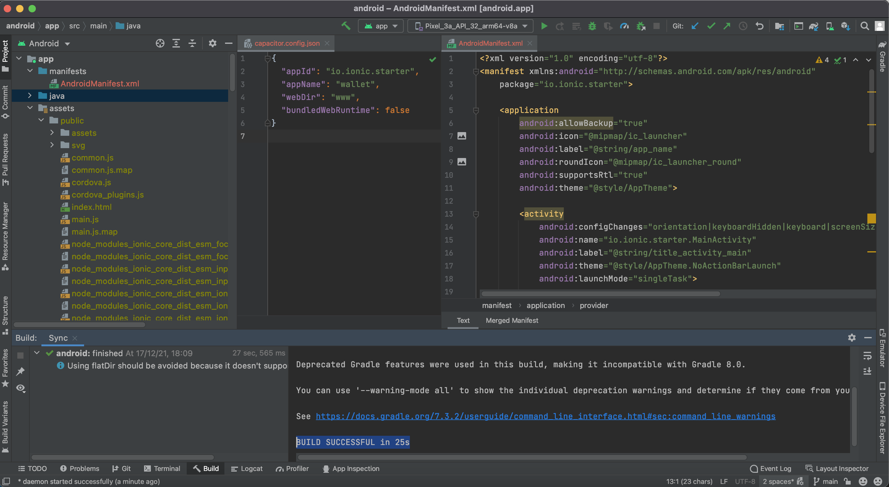

Project Structure:
Android Gradle Plugin Version (7.0.4) & Gradle Version (7.3.2)

## Architecture

Backend: **Spring boot** Java architecture chosen to test multi-threading implementation of large-scale projects that several tasks can be performed concurrently to a lot of simultaneous work.

pom.xml artifacts
```sh
spring-boot-starter
spring-boot-starter-test
spring-boot-starter-data-jpa
postgresql
spring-boot-starter-web
spring-boot-starter-security
jjwt
spring-boot-starter-validation
spring-boot-devtools
spring-data-redis
spring-boot-starter-data-redis
spring-boot-maven-plugin
```

REST Response
```sh
ALL  HttpStatus.FORBIDDEN (access denied)
ALL  HttpStatus.INTERNAL_SERVER_ERROR (system fails)
ALL  HttpStatus.UNAUTHORIZED (auth)
POST HttpStatus.CONFLICT (idempotency)
POST HttpStatus.PRECONDITION_FAILED (business rules)
POST HttpStatus.CREATED (saved ok)
GET  HttpStatus.NO_CONTENT (empty)
```

**Security**: The APP protect the wallet using JWT mechanism

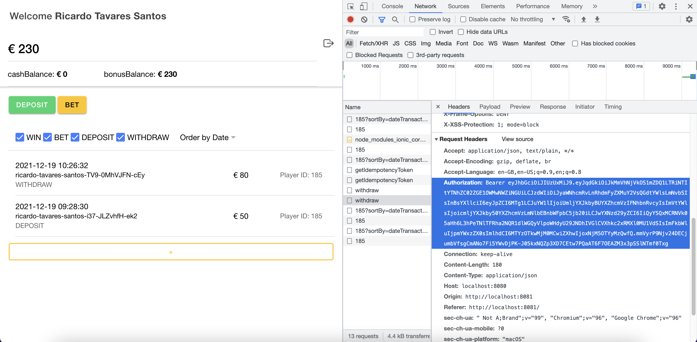

**Idempotency**: The APP supports idempotency for safely retrying requests without accidentally performing the same operation twice.


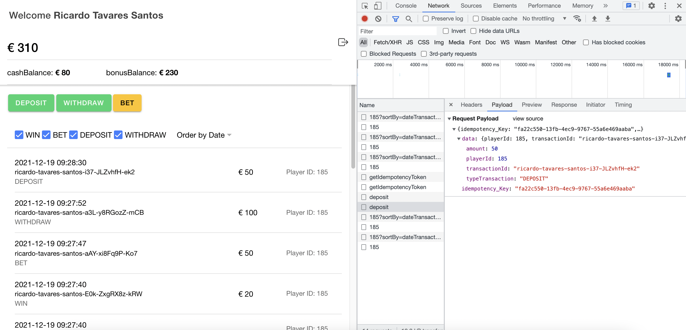

**Sorting & Pagination**: The APP supports sorting and pagination on the read transactions endpoint.

```sh
Service: Pageable paging = PageRequest.of(pageNo, pageSize, Sort.by(Sort.Direction.DESC, sortBy));
Repository: List<Transaction> findByPlayerId(long playerId, Pageable pageable);
Controller:
	@GetMapping("/transactions/{playerId}")
	public ResponseEntity<List<TransactionListDto>> getTransactions(
			@PathVariable("playerId") long playerId,
			@RequestParam(defaultValue = "0") Integer pageNo,
			@RequestParam(defaultValue = "10") Integer pageSize,
			@RequestParam(defaultValue = "dateTransaction") String sortBy) {
		try {
			List<TransactionListDto> lTransactionListDto = new ArrayList<TransactionListDto>();
			lTransactionListDto = logicService.findAllTransactions(playerId, pageNo, pageSize, sortBy);
			if (lTransactionListDto.isEmpty()) {
				return new ResponseEntity<>(HttpStatus.NO_CONTENT);
			}
			return new ResponseEntity<>(lTransactionListDto, HttpStatus.OK);
		} catch (Exception e) {
			System.out.println("/transactions : "+e);
			return new ResponseEntity<>(null, HttpStatus.INTERNAL_SERVER_ERROR);
		}
	}
```
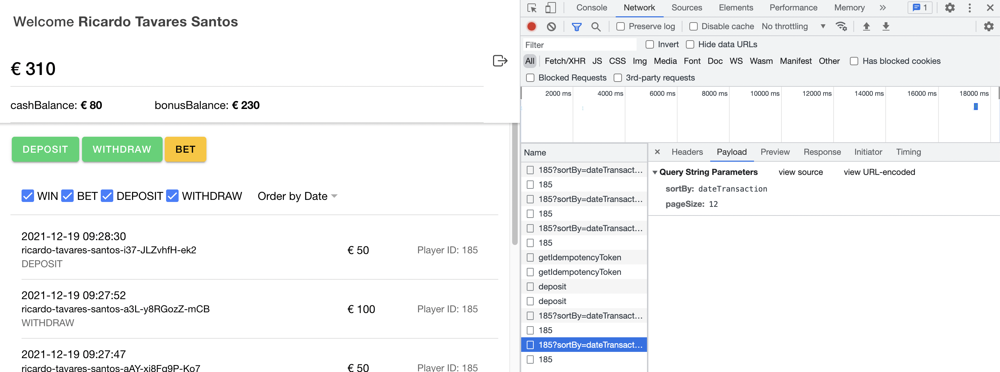
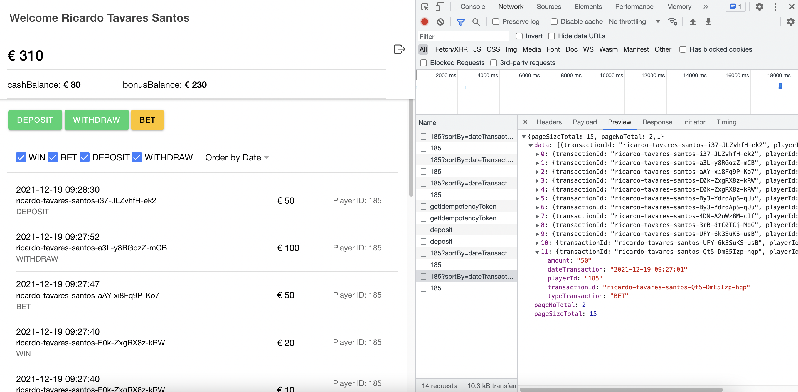

Frontend: **Angular** architecture chosen to test build complex enterprise-grade apps like single-page apps and progressive web apps using its model-view-controller capability that augments the functionalities of browser-based applications by reducing the javascript code needed to keep the application functional and robust.

**Ionic:** Cross-platform mobile app development

## DB

**Postgres** adheres more closely to SQL standards and is an object-relational database that includes features like table inheritance unlike MySQL is a purely relational database. With **Hibernate** the column can containing the class name when mapping.

AWS RDS Postgres or **Docker**

docker-compose.yml

```sh
  db:
    image: postgres:10.5
    environment:
      - POSTGRES_DB=springlabs
      - POSTGRES_USER=postgres
      - POSTGRES_PASSWORD=123456
      - POSTGRES_INITDB_ARGS=--debug
    ports:
      - 5432:5432
```

**Redis** in-memory key–value database to store **Idempotency Key** 

AWS ElastiCache Redis or **Docker**

docker-compose.yml

```sh
  redis:
    image: 'bitnami/redis:latest'
    environment:
      - ALLOW_EMPTY_PASSWORD=yes
    ports:
      - 6379:6379   
```

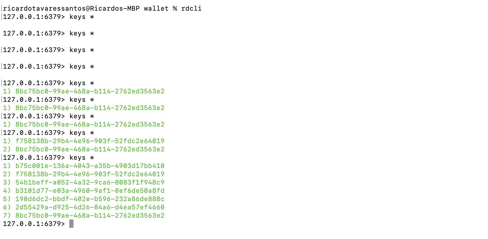

JPA & JWT

application.properties

```sh
# CASE AWS RDS > spring.datasource.url= jdbc:postgresql://nnnnnnnnnnn.nnnnnnnn.us-east-1.rds.amazonaws.com:5432/springlabs
spring.datasource.url= jdbc:postgresql://localhost:5432/springlabs
spring.datasource.username= postgres
spring.datasource.password= 123456

spring.jpa.properties.hibernate.jdbc.lob.non_contextual_creation= true
spring.jpa.properties.hibernate.dialect= org.hibernate.dialect.PostgreSQLDialect

# Hibernate ddl auto (create, create-drop, validate, update)
spring.jpa.hibernate.ddl-auto= update

# for not restarting the server every time
# spring.devtools.restart.enabled:  false

app.secret = "ricardo.tavares"
app.tokenValidityInSeconds = 60000

spring.redis.host = 127.0.0.1
spring.redis.port = 6379
```

```sh
@Entity
@Table(name = "player")
public class Player {
	@Id
	@GeneratedValue(strategy = GenerationType.AUTO)
	private long id;

	@Column(name = "name")
	private String name;

	@Column(name = "email")
	private String email;

	@Column(name = "password")
	private String password;

        @Column(name = "admin")
	private boolean admin;
```

```sh
@Entity
@Table(name = "wallet")
public class Wallet {
	@Id
	@GeneratedValue(strategy = GenerationType.AUTO)
	private long id;

        @Column(name = "playerId")
	private long playerId;

	@Column(name = "cashBalance")
	private long cashBalance;

	@Column(name = "bonusBalance")
	private long bonusBalance;
```

```sh
@Entity
@Table(name = "transaction")
public class Transaction {
	@Id
	@GeneratedValue(strategy = GenerationType.AUTO)
	private long id;

        @Column(name = "playerId")
	private long playerId;

	@Column(name = "transactionId")
	private String transactionId;

	@Column(name = "amount")
	private long amount;

	@Column(name = "dateTransaction")
	private Date dateTransaction;

        @Enumerated(EnumType.STRING)
        @Column(name = "typeTransaction")
        private TypeTransaction typeTransaction;
```

@Enumerated
```sh
public enum TypeTransaction {
	WIN,
	BET,
        DEPOSIT,
        WITHDRAW;
}
```


## Backend

JWT Authentication, Spring Boot Maven (Security, Web, Data, JPA & Hibernate) + PostgreSQL

```sh
(Apache Maven) brew install maven
mvn spring-boot:run
```

Postman
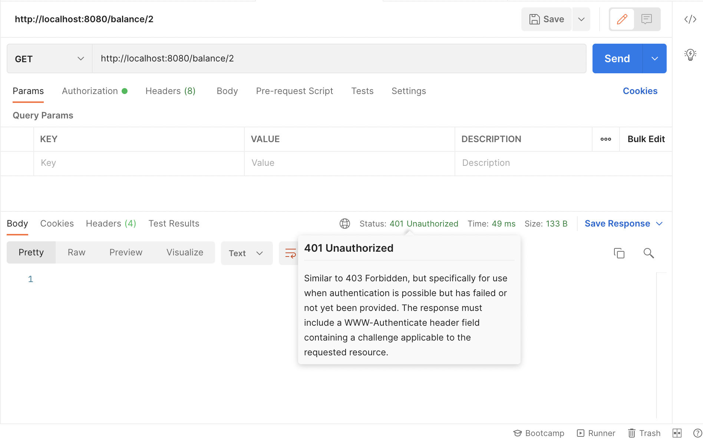
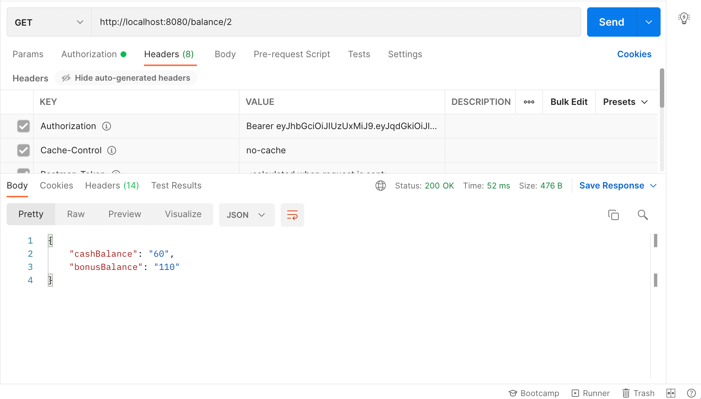
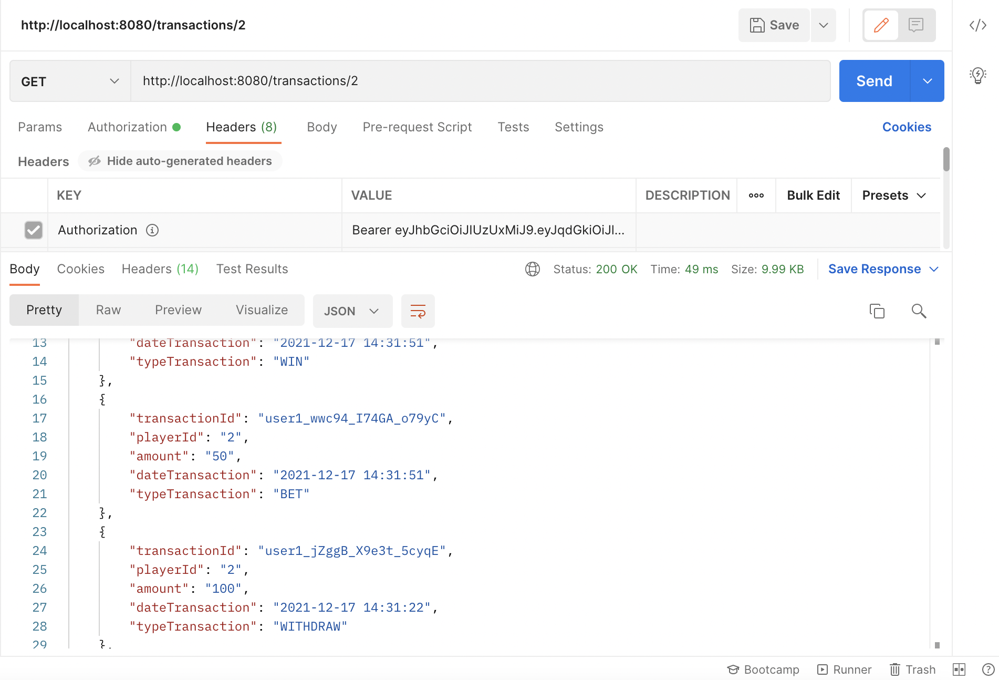

## Frontend ionic angular

JWT Authentication with Ionic/Angular and Spring Boot

## S3 Static Website

```sh
ng build --prod
```

copy files dist/angular-pwa folder to S3

Config CORS & User Pool (redirect)

## TEST

With the @SpringBootTest annotation is enough to load the ApplicationContext. Spring Boot provides a convenient way to start up an application context to be used in a test.

- JUnit5 (Jupiter)

Itempotency Test

```sh
	@Test
	public void should_Itempotency() throws Exception {
		String token = tokenService.createToken();
		assertNotNull(token);
		TransactionSaveDto lTransactionSaveDto = new TransactionSaveDto();
		lTransactionSaveDto.setIdempotency_Key(token);
		ObjectMapper mapper = new ObjectMapper();
		mapper.configure(SerializationFeature.WRAP_ROOT_VALUE, false);
		ObjectWriter ow = mapper.writer().withDefaultPrettyPrinter();
		String requestJson=ow.writeValueAsString(lTransactionSaveDto);
		mvc.perform(MockMvcRequestBuilders
				.post("/idempotency")
				.contentType(MediaType.APPLICATION_JSON)
				.content(requestJson)).andExpect(status().isOk());
		mvc.perform(MockMvcRequestBuilders
				.post("/idempotency")
				.contentType(MediaType.APPLICATION_JSON)
				.content(requestJson)).andExpect(status().isConflict());
	}
```
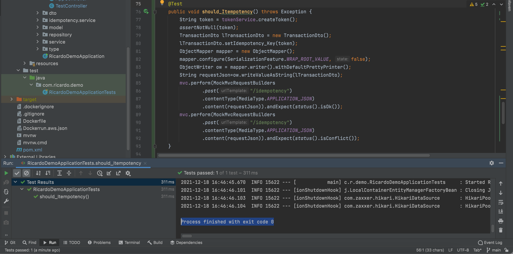

```sh
	@Test
	public void should_Not_Itempotency() throws Exception {
		String token = "7777777777777777777777777 because i can ";
		TransactionSaveDto lTransactionSaveDto = new TransactionSaveDto();
		lTransactionSaveDto.setIdempotency_Key(token);
		ObjectMapper mapper = new ObjectMapper();
		mapper.configure(SerializationFeature.WRAP_ROOT_VALUE, false);
		ObjectWriter ow = mapper.writer().withDefaultPrettyPrinter();
		String requestJson=ow.writeValueAsString(lTransactionSaveDto);
		mvc.perform(MockMvcRequestBuilders
				.post("/idempotency")
				.contentType(MediaType.APPLICATION_JSON)
				.content(requestJson)).andExpect(status().isConflict());
	}
```
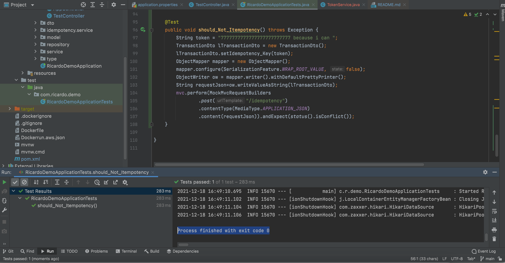


Unit Tests: covers a single auth class.

```sh
	@Test
	public void should_AllowAccess() throws Exception {
		mvc.perform(MockMvcRequestBuilders.get("/public")).andExpect(status().isOk());
	}

	@Test
	public void should_NotAllowAccess() throws Exception {
		mvc.perform(MockMvcRequestBuilders.get("/secret")).andExpect(status().isForbidden());
	}

	@Test
	public void should_NotAllowAccessToUnauthenticatedUsers() throws Exception {
		mvc.perform(MockMvcRequestBuilders.get("/api")).andExpect(status().isForbidden());
	}
```

Integration Tests: covers the whole path through the application. In these tests, we send a request to the application and check that it responds correctly and has changed the database state according to our expectations.

```sh
	@Test
	public void should_InsertUser_GenerateAuthToken_DeleteUser() throws Exception {
		String email = "application@test.com";
		Player user = new Player("name", false, email, "password");
		userRepository.save(user);
		List<Player> users = userRepository.findByEmail(email);
		assertNotNull(users.size()>0?true:null);

		String token = this.tokenProvider.createToken(user);
		assertNotNull(token);
		mvc.perform(MockMvcRequestBuilders.get("/secret").header("Authorization", "Bearer " + token)).andExpect(status().isOk());

		userRepository.deleteById(users.stream().findFirst().get().getId());
		users = userRepository.findByEmail(email);

		assertNull(users.size()>0?true:null);
	}
```

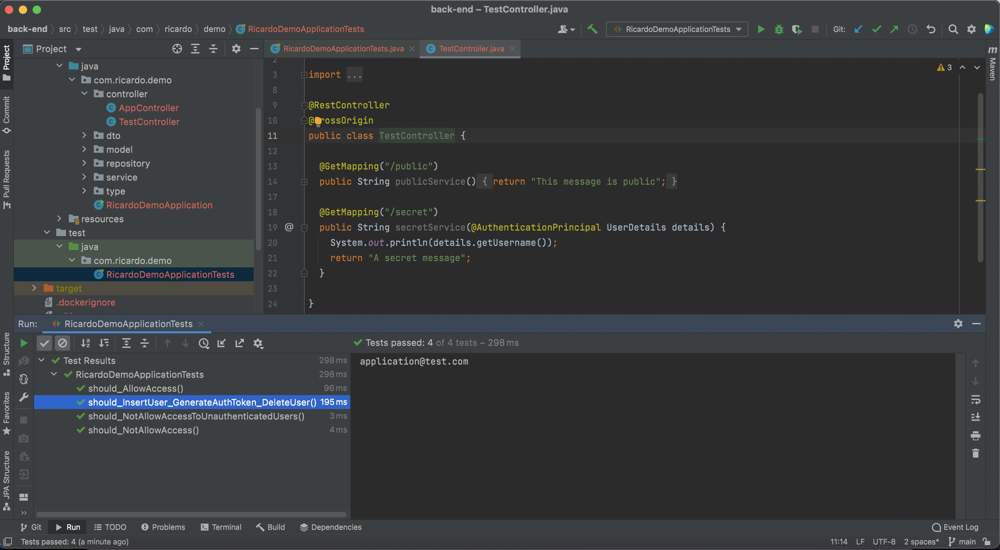
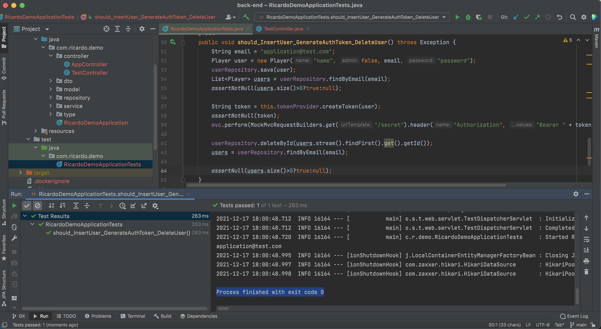

- Set up Jenkins to run Postman collection using Newman

CreatePostman Collection

```sh
http://localhost:8080/public GET
http://localhost:8080/secret GET
```


Run a collection using Newman

```sh
npm install -g newman
newman run demo_ricardo.postman_collection.json
```

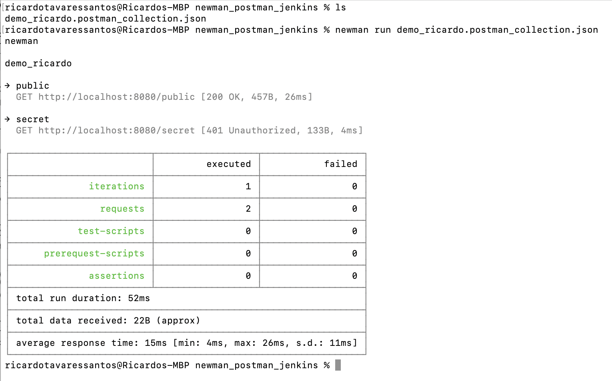

Set up Jenkins

```sh
docker pull jenkins/jenkins:lts-jdk11
docker run -p 8085:8080 -p 50000:50000 jenkins/jenkins:lts-jdk11 (port 8080 backend and 8081 frontend)

http://localhost:8085
```

In Global Tool Configuration add Nodejs and in "Global npm packages to install" add newman. Create a new job (Freestyle Project). Provide Node & npm bin/ folder to PATH and add a build step to executes a shell command.

```sh
newman run https://www.getpostman.com/collections/72c71a023e70e60d1b0a --suppress-exit-code 1
```

suppress-exit-code uses the value 1. This denotes that Newman is going to exit with this code that will tell Jenkins that everything did not go well.

Build Now!


## Auth APIs list

```sh
http://localhost:8080/authenticate
http://localhost:8080/login
http://localhost:8080/signup
```

```sh
@RestController
@CrossOrigin
public class TestController {

  @GetMapping("/public")
  public String publicService() {
    return "This message is public";
  }

  @GetMapping("/secret")
  public String secretService(@AuthenticationPrincipal UserDetails details) {
    System.out.println(details.getUsername());
    return "A secret message";
  }

  @PostMapping("/idempotency")
  public ResponseEntity<IdempotencyDto> checkIdempotency(@RequestBody TransactionDto lTransactionDto) {
    IdempotencyDto lIdempotencyDto = new IdempotencyDto();
    String tokenMsg = tokenService.checkToken(lTransactionDto.getIdempotency_Key());
    lIdempotencyDto.setMsg(tokenMsg);
    if(tokenMsg=="OK") {
      return new ResponseEntity<>(lIdempotencyDto, HttpStatus.OK);
    }
    return new ResponseEntity<>(lIdempotencyDto, HttpStatus.CONFLICT);
  }

}
```

## APIs list

```sh
GET /getIdempotencyToken
```
```sh
POST /deposit 
Deposit money to the player’s wallet, awarding him/her a 100% bonus for any deposit greater than €100

POST /withdraw
Allow the player to withdraw money from his wallet (only cash balances can be withdrawn)

POST /bet 
Registers a bet placed by the player

POST /win 
Registers a win for the player. If the player loses his bet, a win of €0 can be sent to the wallet

GET /transactions 
Allows for retrieval of transaction data for all players. Endpoint should support filtering.

GET /balance Allows for retrieval of balance for a specific player.
```
